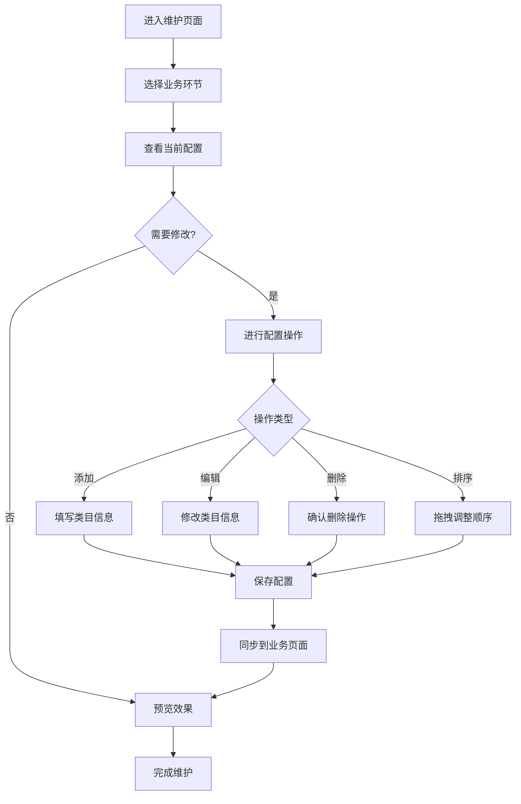

# 材料提交模板维护页面设计文档

## 1. 页面概述

### 1.1 功能定位
材料提交模板维护页面作为系统的基础配置模块，位于"日常维护"菜单下，用于统一管理立项申请、项目开题、项目中期、项目验收等各环节所需提交的资料类目和模板。

### 1.2 设计目标
- **统一管理**：在一个页面中集中管理所有业务环节的资料类目
- **灵活配置**：支持自定义类目名称、必填设置、模板文件维护
- **实时同步**：配置完成后自动同步到对应的业务页面
- **操作便捷**：提供直观的操作界面，降低维护成本

## 2. 整体布局设计

### 2.1 页面布局
```
┌─────────────────────────────────────────────────────────────┐
│  📋 材料提交模板维护                                        │
├─────────────────────────────────────────────────────────────┤
│  [立项申请] [项目开题] [项目中期] [项目验收]                 │
├─────────────────────────────────────────────────────────────┤
│  ┌─ 当前配置：立项申请 ──────────────────────────────────┐  │
│  │  + 添加新类目                              [批量导入] │  │
│  │                                                      │  │
│  │  序号  类目名称      必填项  模板文件    操作        │  │
│  │  ──────────────────────────────────────────────────  │  │
│  │   1   项目申请书      ✓     📄 模板1.doc  编辑 删除  │  │
│  │   2   可行性研究报告  ✓     📄 模板2.doc  编辑 删除  │  │
│  │   3   预算明细表      ✓     📄 模板3.xls  编辑 删除  │  │
│  │   4   团队成员简历    ○     📄 模板4.doc  编辑 删除  │  │
│  │   5   相关证明材料    ○     无模板         编辑 删除  │  │
│  │                                                      │  │
│  │  [保存配置] [预览效果] [重置默认]                   │  │
│  └──────────────────────────────────────────────────────┘  │
└─────────────────────────────────────────────────────────────┘
```

### 2.2 标签页设计
- **立项申请**：配置立项申请环节的资料类目
- **项目开题**：配置项目开题环节的资料类目
- **项目中期**：配置项目中期环节的资料类目
- **项目验收**：配置项目验收环节的资料类目

## 3. 功能模块详细设计

### 3.1 类目管理功能

#### 3.1.1 添加新类目
**触发方式**：点击"+ 添加新类目"按钮

**弹窗界面**：
```
┌─ 添加资料类目 ────────────────────────┐
│                                        │
│  类目名称：[________________]          │
│           （如：项目申请书）            │
│                                        │
│  是否必填：( ✓ ) 必填  ( ○ ) 选填     │
│                                        │
│  模板文件：[选择文件] [预览] [下载]   │
│           📄 当前：项目申请书模板.doc   │
│                                        │
│  显示顺序：[___3___]                   │
│                                        │
│  描述说明：[________________________] │
│           [________________________]  │
│                                        │
│           [确定] [取消]                │
└────────────────────────────────────────┘
```

#### 3.1.2 编辑类目
**触发方式**：点击类目行的"编辑"按钮

**功能**：
- 修改类目名称
- 调整必填/选填设置
- 更换或更新模板文件
- 修改显示顺序
- 编辑描述说明

#### 3.1.3 删除类目
**触发方式**：点击类目行的"删除"按钮

**确认机制**：
```
┌─ 确认删除 ──────────────────────┐
│                                  │
│  ⚠️  确定要删除以下类目吗？      │
│                                  │
│  类目名称：项目申请书            │
│  影响范围：立项申请页面          │
│                                  │
│  删除后将无法恢复，请谨慎操作！  │
│                                  │
│        [确定删除] [取消]         │
└──────────────────────────────────┘
```

### 3.2 模板文件管理

#### 3.2.1 模板上传
- **支持格式**：.doc、.docx、.xls、.xlsx、.pdf、.txt
- **文件大小**：限制10MB以内
- **命名规范**：自动添加时间戳，避免重名冲突

#### 3.2.2 模板预览
- **在线预览**：支持常见格式的在线预览
- **下载功能**：提供模板文件下载
- **版本管理**：保留历史版本，支持版本回退

### 3.3 批量操作功能

#### 3.3.1 批量导入
**Excel模板格式**：
```
| 序号 | 类目名称     | 必填项 | 模板文件名    | 描述说明     |
|------|-------------|--------|---------------|--------------|
| 1    | 项目申请书   | 是     | 申请书.doc    | 详细项目信息 |
| 2    | 预算明细     | 是     | 预算表.xls    | 经费预算     |
```

#### 3.3.2 批量导出
- **导出当前配置**：将当前标签页配置导出为Excel
- **导出全部配置**：将所有环节配置导出
- **导出模板包**：打包所有模板文件

### 3.4 配置同步功能

#### 3.4.1 实时预览
**预览界面**：
```
┌─ 效果预览：立项申请页面 ──────────────────┐
│                                            │
│  📄 资料提交                              │
│  ──────────────────────────────────────── │
│  1. * 项目申请书           [上传] [模板]  │
│  2. * 可行性研究报告       [上传] [模板]  │
│  3. * 预算明细表           [上传] [模板]  │
│  4.   团队成员简历         [上传] [模板]  │
│  5.   相关证明材料         [上传] 无模板   │
│                                            │
│  * 为必填项                               │
│                                            │
│                    [关闭预览]              │
└────────────────────────────────────────────┘
```

#### 3.4.2 配置应用
- **保存并应用**：配置保存后立即同步到业务页面
- **批量应用**：支持将配置应用到多个环节
- **回滚机制**：支持配置回滚到上一版本

## 4. 数据结构设计

### 4.1 配置数据表
```sql
-- 材料类目配置表
CREATE TABLE material_category_config (
    id BIGINT PRIMARY KEY,
    business_type VARCHAR(20) NOT NULL,  -- 业务类型：apply,opening,midterm,acceptance
    category_name VARCHAR(100) NOT NULL, -- 类目名称
    is_required TINYINT DEFAULT 0,       -- 是否必填：0-选填，1-必填
    template_file_path VARCHAR(500),     -- 模板文件路径
    template_file_name VARCHAR(200),     -- 模板文件名
    sort_order INT DEFAULT 0,            -- 排序序号
    description TEXT,                    -- 描述说明
    status TINYINT DEFAULT 1,            -- 状态：0-禁用，1-启用
    create_time DATETIME,
    update_time DATETIME,
    creator VARCHAR(50),
    updater VARCHAR(50)
);

-- 配置变更历史表
CREATE TABLE material_config_history (
    id BIGINT PRIMARY KEY,
    config_id BIGINT,                    -- 关联配置ID
    operation_type VARCHAR(20),          -- 操作类型：CREATE,UPDATE,DELETE
    before_data JSON,                    -- 变更前数据
    after_data JSON,                     -- 变更后数据
    operation_time DATETIME,
    operator VARCHAR(50)
);
```

### 4.2 前端数据模型
```javascript
// 类目配置数据模型
interface MaterialCategory {
  id: number;
  businessType: 'apply' | 'opening' | 'midterm' | 'acceptance';
  categoryName: string;
  isRequired: boolean;
  templateFilePath?: string;
  templateFileName?: string;
  sortOrder: number;
  description?: string;
  status: number;
}

// 配置操作数据模型
interface ConfigOperation {
  type: 'add' | 'edit' | 'delete' | 'sort';
  data: MaterialCategory;
  target?: number; // 目标位置（排序时使用）
}
```

## 5. 交互流程设计

### 5.1 配置维护流程


### 5.2 模板管理流程


## 6. 界面设计规范

### 6.1 色彩设计
- **主色调**：沿用系统蓝色主题 (#1890ff)
- **状态色彩**：
  - 必填项：红色星号 (#ff4d4f)
  - 选填项：灰色圆圈 (#d9d9d9)
  - 成功状态：绿色 (#52c41a)
  - 警告状态：橙色 (#fa8c16)

### 6.2 图标设计
- **文件类型图标**：
  - 📄 Word文档
  - 📊 Excel表格
  - 📋 PDF文档
  - 📝 文本文件
- **操作图标**：
  - ➕ 添加
  - ✏️ 编辑
  - 🗑️ 删除
  - 👁️ 预览
  - ⬇️ 下载

### 6.3 响应式设计
- **桌面端**：1200px以上，展示完整表格布局
- **平板端**：768px-1199px，紧凑型表格布局
- **移动端**：767px以下，卡片式布局

## 7. 技术实现要点

### 7.1 前端技术栈
- **框架**：Vue 3 + Element Plus
- **状态管理**：Pinia
- **文件上传**：el-upload组件
- **表格操作**：el-table + 自定义操作列
- **拖拽排序**：Sortable.js

### 7.2 关键功能实现

#### 7.2.1 动态表单生成
```javascript
// 根据配置动态生成表单项
const generateFormItems = (configs) => {
  return configs.map(config => ({
    prop: `file_${config.id}`,
    label: config.categoryName,
    required: config.isRequired,
    type: 'upload',
    templateUrl: config.templateFilePath,
    templateName: config.templateFileName
  }));
};
```

#### 7.2.2 配置同步机制
```javascript
// 配置保存后同步到业务页面
const syncConfigToPages = async (businessType, configs) => {
  const targetPages = getTargetPages(businessType);
  
  for (const page of targetPages) {
    await updatePageConfig(page, configs);
  }
  
  // 刷新相关页面缓存
  await refreshPageCache(targetPages);
};
```

## 8. 测试验证方案

### 8.1 功能测试
- **基础操作测试**：增删改查、排序、文件上传下载
- **数据验证测试**：必填项验证、文件格式验证、重名检测
- **同步测试**：配置修改后业务页面的同步效果
- **权限测试**：不同角色的操作权限验证

### 8.2 性能测试
- **大数据量测试**：100+类目配置的页面响应速度
- **文件上传测试**：多文件同时上传的性能表现
- **并发测试**：多用户同时维护配置的数据一致性

### 8.3 兼容性测试
- **浏览器兼容**：Chrome、Firefox、Safari、Edge
- **设备兼容**：PC端、平板、手机端响应式效果
- **文件格式兼容**：各种Office文档的预览下载

## 9. 实施计划

### 9.1 开发阶段
**第一阶段（3天）**：基础页面框架搭建
- 页面布局设计
- 标签页切换功能
- 基础表格展示

**第二阶段（4天）**：核心功能开发
- 类目增删改功能
- 文件上传下载功能
- 配置保存加载功能

**第三阶段（3天）**：高级功能开发
- 批量操作功能
- 预览同步功能
- 拖拽排序功能

**第四阶段（2天）**：测试优化
- 功能测试验证
- 性能优化调整
- 用户体验优化

### 9.2 上线部署
- **测试环境验证**：全功能测试验证
- **生产环境部署**：分步骤上线
- **用户培训**：操作手册编写和培训
- **监控反馈**：上线后效果监控和反馈收集

## 10. 维护方案

### 10.1 数据备份
- **自动备份**：每日定时备份配置数据
- **版本管理**：保留配置变更历史
- **一键恢复**：支持快速恢复到历史版本

### 10.2 监控告警
- **异常监控**：配置同步失败告警
- **性能监控**：页面响应时间监控
- **使用统计**：功能使用情况统计分析

---

*本设计文档为材料提交模板维护页面的完整设计方案，包含了功能规划、界面设计、技术实现等各个方面的详细说明。* 