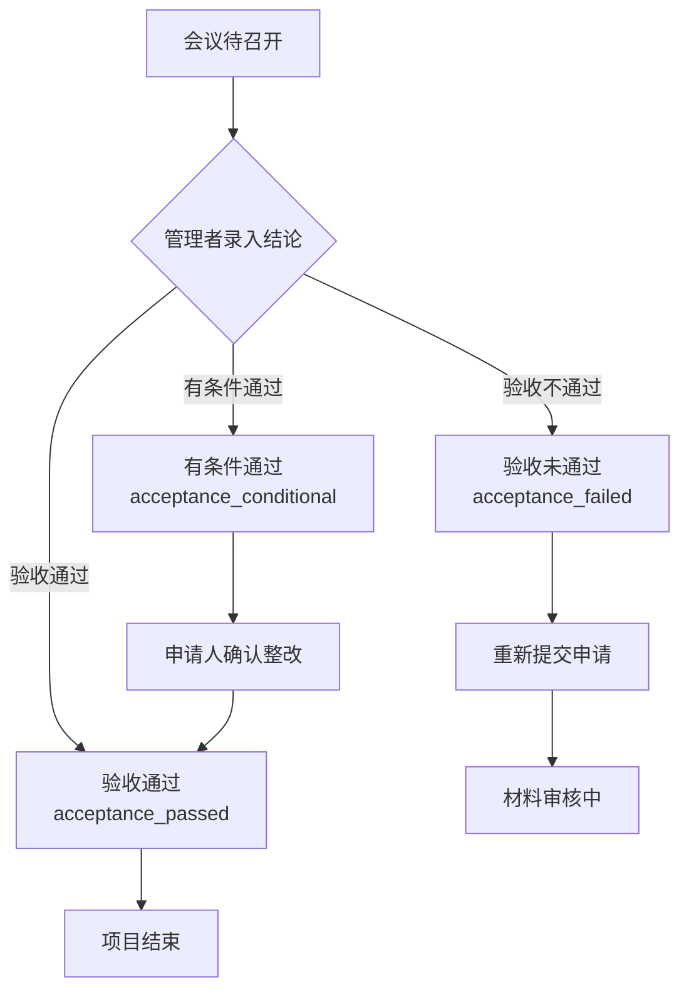

# 验收结论状态映射方案

## 1. 管理者验收结论与申请人状态映射

### 1.1 三种验收结论详细说明

| 管理者选择 | 结论含义 | 申请人状态 | 状态码 | 显示颜色 | 进度 | 后续操作 |
|------------|----------|------------|--------|----------|------|----------|
| **验收通过** | 项目完全达到验收要求，无需整改 | 验收通过 | `acceptance_passed` | 绿色 | 100% | 项目结束，归档 |
| **有条件通过** | 项目基本达到要求，需完成指定整改 | 有条件通过 | `acceptance_conditional` | 橙色 | 95% | 确认整改完成 |
| **验收不通过** | 项目未达到验收要求，需重新申请 | 验收未通过 | `acceptance_failed` | 红色 | 100% | 重新提交申请 |

### 1.2 状态流转图



## 2. 申请人界面差异化处理

### 2.1 操作按钮差异

| 状态 | 主要操作按钮 | 按钮样式 | 操作说明 |
|------|-------------|----------|----------|
| `acceptance_passed` | 无特殊操作 | - | 可查看验收报告，下载相关材料 |
| `acceptance_conditional` | **确认整改** | 主要按钮(蓝色) | 点击确认整改完成，状态变为通过 |
| `acceptance_failed` | **重新提交** | 主要按钮(红色) | 根据验收意见重新准备材料申请 |

### 2.2 状态显示差异

#### 验收通过 (acceptance_passed)
- **进度条**：100%，绿色成功状态
- **状态标签**：绿色"验收通过"
- **说明文字**：项目验收完成，恭喜您！
- **可用操作**：查看验收报告、下载材料、项目归档

#### 有条件通过 (acceptance_conditional)
- **进度条**：95%，橙色活跃状态
- **状态标签**：橙色"有条件通过"
- **说明文字**：项目基本通过验收，请按要求完成整改
- **整改要求**：显著展示整改要求列表
- **可用操作**：确认整改、查看整改要求、上传整改材料

#### 验收未通过 (acceptance_failed)
- **进度条**：100%，红色异常状态
- **状态标签**：红色"验收未通过"
- **说明文字**：项目未通过验收，请根据意见重新申请
- **整改要求**：详细显示需要改进的问题
- **可用操作**：重新提交、查看验收意见、下载反馈报告

## 3. 技术实现方案

### 3.1 状态同步机制

```javascript
// 管理者端 - 结论录入后的状态同步
const syncStatusToApplicant = async (projectId, conclusion) => {
  const statusMapping = {
    'passed': 'acceptance_passed',
    'conditional_passed': 'acceptance_conditional', 
    'failed': 'acceptance_failed'
  }
  
  const applicantStatus = statusMapping[conclusion]
  
  // 调用API更新申请人状态
  await updateApplicantStatus(projectId, applicantStatus)
  
  // 发送状态变更通知
  await sendStatusNotification(projectId, applicantStatus)
}
```

### 3.2 申请人端状态处理

```javascript
// 申请人端 - 根据状态显示不同内容
const getStatusConfig = (status) => {
  const configs = {
    acceptance_passed: {
      color: 'green',
      text: '验收通过',
      progress: 100,
      progressStatus: 'success',
      description: '项目验收完成，恭喜您！',
      actions: ['查看报告', '下载材料']
    },
    acceptance_conditional: {
      color: 'orange', 
      text: '有条件通过',
      progress: 95,
      progressStatus: 'active',
      description: '项目基本通过验收，请按要求完成整改',
      actions: ['确认整改', '查看要求']
    },
    acceptance_failed: {
      color: 'red',
      text: '验收未通过', 
      progress: 100,
      progressStatus: 'exception',
      description: '项目未通过验收，请根据意见重新申请',
      actions: ['重新提交', '查看意见']
    }
  }
  
  return configs[status] || {}
}
```

### 3.3 整改确认流程

```javascript
// 有条件通过的整改确认处理
const handleConfirmImprovement = async (record) => {
  // 1. 弹出整改确认弹窗
  const confirmed = await showImprovementConfirmModal(record)
  
  if (confirmed) {
    // 2. 更新状态为验收通过
    record.status = 'acceptance_passed'
    
    // 3. 调用后端API
    await confirmImprovement(record.id, confirmed.description)
    
    // 4. 显示成功提示
    message.success('整改确认完成，项目验收通过！')
  }
}
```

## 4. 用户体验优化

### 4.1 视觉层面

1. **颜色语言统一**
   - 绿色：成功、通过、完成
   - 橙色：警告、待处理、有条件
   - 红色：失败、驳回、异常

2. **图标系统**
   - ✅ 验收通过：CheckCircleOutlined
   - ⚠️ 有条件通过：ExclamationCircleOutlined  
   - ❌ 验收未通过：CloseCircleOutlined

3. **进度指示**
   - 通过：100% 绿色成功条
   - 有条件：95% 橙色进行中
   - 未通过：100% 红色异常条

### 4.2 交互层面

1. **智能提醒**
   - 状态变更时的实时通知
   - 整改截止日期提醒
   - 操作指引提示

2. **便捷操作**
   - 一键确认整改
   - 快速重新提交
   - 批量下载材料

3. **信息透明**
   - 完整的验收时间线
   - 详细的整改要求说明
   - 清晰的下一步指引

### 4.3 流程优化

1. **有条件通过流程**
   ```
   验收会议 → 有条件通过 → 查看整改要求 → 完成整改 → 确认整改 → 验收通过
   ```

2. **验收未通过流程**
   ```
   验收会议 → 验收未通过 → 查看反馈意见 → 重新准备 → 重新提交申请
   ```

## 5. 数据结构设计

### 5.1 验收结论数据结构

```javascript
{
  id: 'project_id',
  finalResult: {
    conclusion: 'conditional_passed', // passed | conditional_passed | failed
    score: 82,
    time: '2024-01-21',
    description: '项目基本达到验收要求，有条件通过验收。',
    requirements: '1. 完善数据备份机制；2. 优化系统界面布局；3. 30天内提交整改确认。',
    deadline: '2024-02-20', // 整改截止日期
    reviewer: '张专家',
    meetingId: 'meeting_001'
  },
  applicantStatus: 'acceptance_conditional', // 对应的申请人状态
  improvementConfirmed: false, // 是否已确认整改
  improvementDate: null // 整改确认日期
}
```

### 5.2 状态变更日志

```javascript
{
  projectId: 'project_id',
  statusChanges: [
    {
      fromStatus: 'meeting_scheduled',
      toStatus: 'acceptance_conditional', 
      changeTime: '2024-01-21 15:30:00',
      operator: 'manager_001',
      reason: '验收会议结论：有条件通过',
      details: {
        conclusion: 'conditional_passed',
        requirements: '...'
      }
    }
  ]
}
```

## 6. 实施建议

### 6.1 分阶段实施

1. **第一阶段**：完善状态映射逻辑
2. **第二阶段**：优化申请人界面显示
3. **第三阶段**：实现整改确认流程
4. **第四阶段**：完善通知和提醒机制

### 6.2 测试重点

1. **状态同步测试**：确保管理者操作后申请人状态正确更新
2. **界面展示测试**：验证不同状态下的界面显示正确
3. **流程完整性测试**：测试整改确认和重新提交的完整流程
4. **边界情况测试**：测试异常情况下的状态处理

通过这套精细化的状态映射方案，可以让申请人清楚了解验收结果的具体含义，并提供相应的后续操作指引，大大提升用户体验和系统的专业性。 